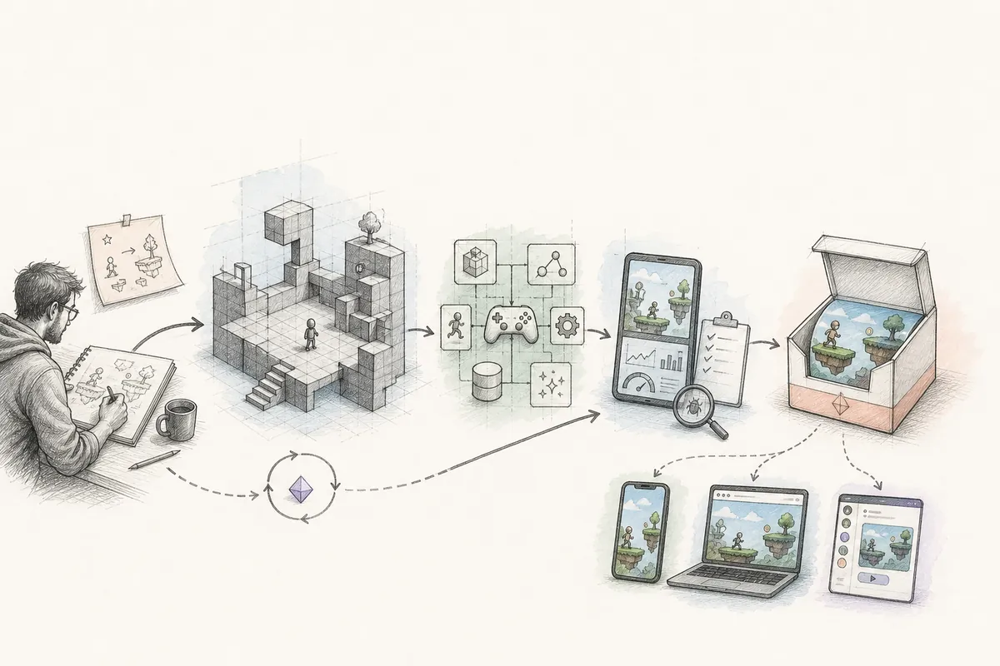
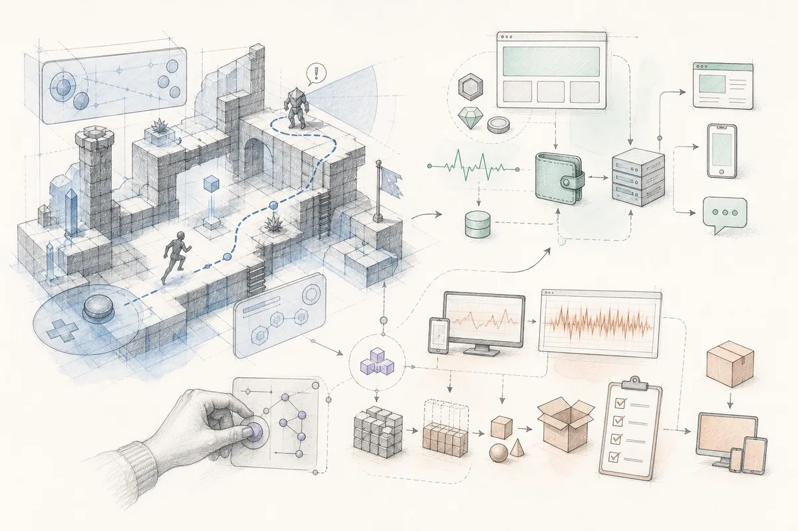
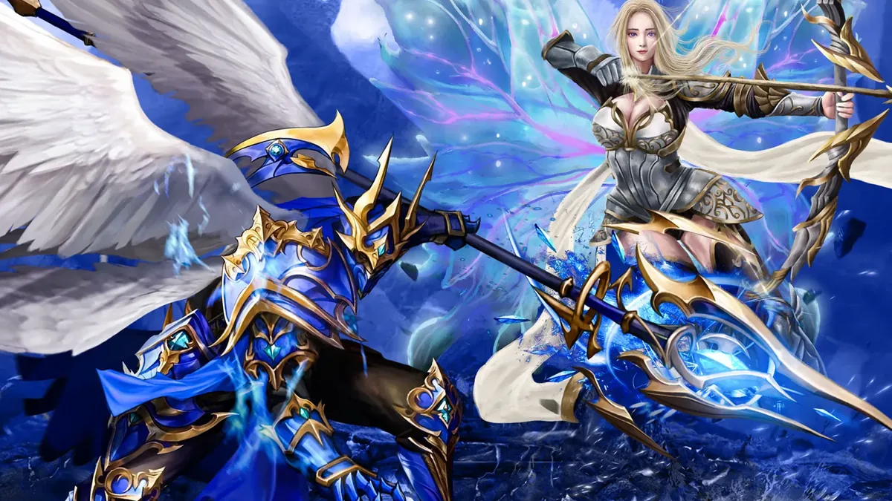
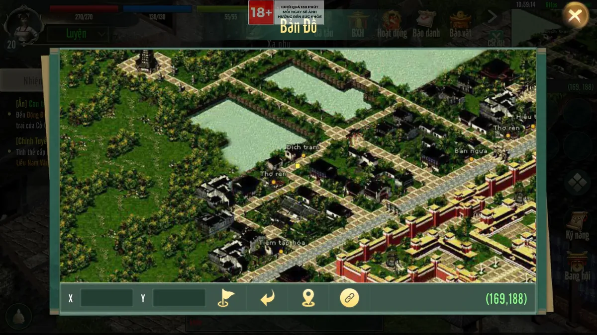
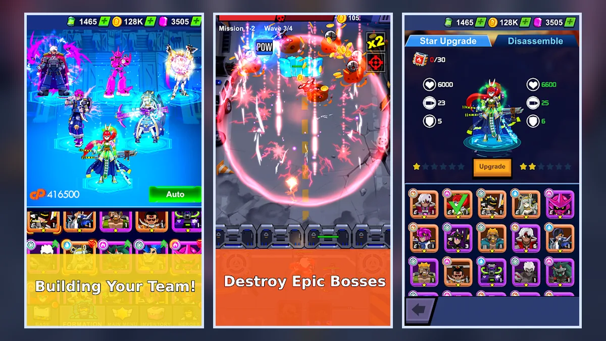
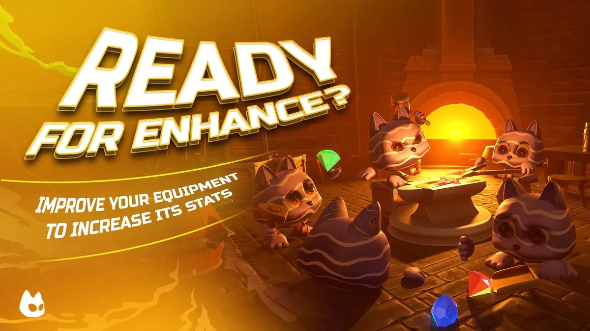
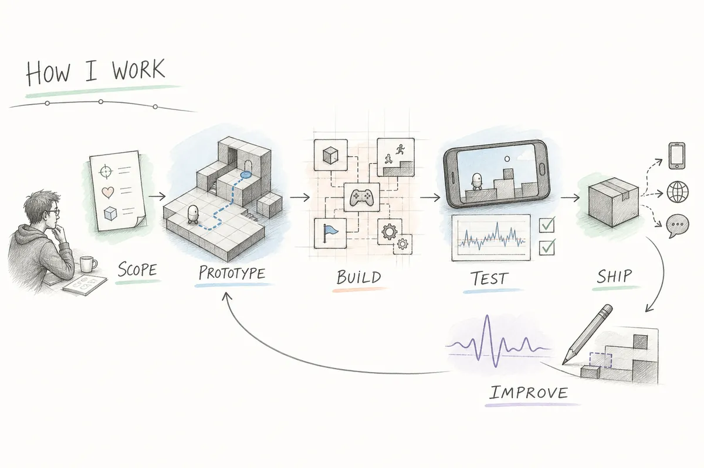
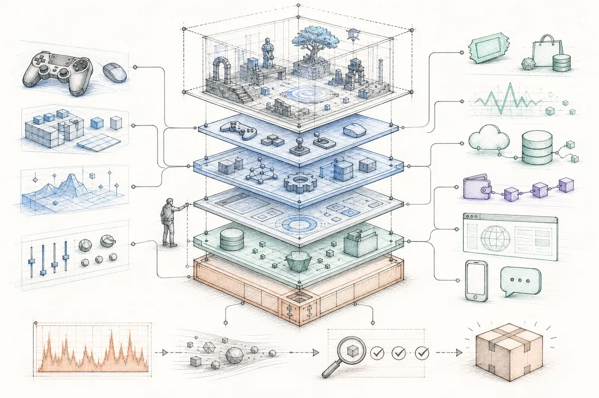
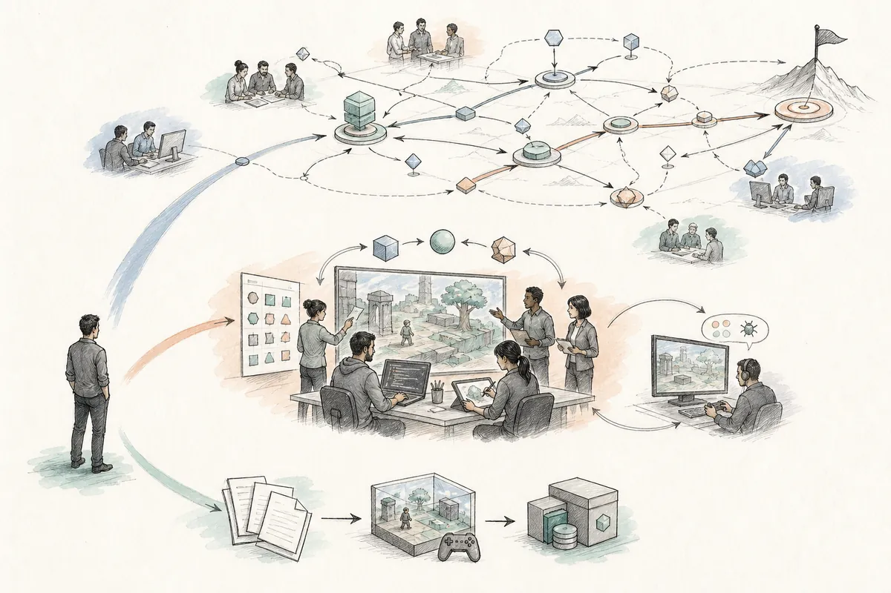

<h1 align="center">HoaTV — Senior Game Developer</h1>

<h3 align="center">From playable prototype to optimized release.</h3>

<p align="center">Unity · Mobile · WebGL · GameFi/Web3 · Telegram/World App · Backend &amp; Automation</p>

<p align="center">
  <a href="https://hoatv2211.github.io/">Portfolio</a> ·
  <a href="mailto:hoatv.mad@gmail.com">Email</a> ·
  <a href="https://t.me/o0_MaD_0o">Telegram</a> ·
  <a href="https://www.linkedin.com/in/hoatv">LinkedIn</a> ·
  <a href="https://github.com/hoatv2211">GitHub</a>
</p>



## Production Partner, Not Just an Implementer

I help studios and product teams turn game ideas into stable, shippable experiences. My work spans gameplay systems, UI/UX implementation, monetization, performance profiling, platform integration, backend-connected features, publishing, and production support.

My strongest fit is work that needs both hands-on development and production ownership: understanding the player experience, making practical technical decisions, coordinating across disciplines, and carrying features through QA and release.

| Production proof | Scope |
|---|---|
| **8+ years** | Professional game-industry experience |
| **100+ games** | Delivered or published, including private outsource work |
| **5–15 people** | Developers, artists, and designers managed or mentored |
| **Cross-platform** | Android, iOS, WebGL, Telegram Mini App, and World App |

## What I Can Deliver



### Gameplay & Product Systems

- Core loops, character controllers, combat, AI, quests, progression, economies, live events, and content systems.
- 2D and 3D Unity production for mobile, WebGL, prototypes, commercial games, and long-running products.
- UI/UX implementation, animation, feedback, onboarding flows, and production-ready menus.

### Monetization & Platform Integration

- Ads, in-app purchases, analytics, SDK integrations, notifications, and publishing workflows.
- Wallets, NFT assets, staking-style systems, GameFi economies, and Web3 mini-app integrations.
- Firebase, Docker-based services, Supabase, AWS-connected workflows, Telegram bots, and automation pipelines.

### Optimization & Release

- Rendering, loading, memory, build-size, and repeated gameplay-hotspot profiling.
- Device coverage, WebGL constraints, QA support, store preparation, release stabilization, and live maintenance.
- Refactoring fragile gameplay flows without interrupting active content production.

### Technical Leadership

- Feature scoping, architecture decisions, estimation, code review, mentoring, and cross-discipline coordination.
- Agile/Scrum delivery, CI/CD awareness, production risk management, and practical trade-off decisions.
- Hands-on implementation alongside leadership rather than architecture-only oversight.

## Selected Production Work

All visuals below come from real project assets in this repository. Contribution details are limited to documented roles and responsibilities.

| [MU Loren Mobile](https://hoatv2211.github.io/projects/mu-loren-mobile/) | [JX1 Mobile / Tình Thiên Hạ](https://hoatv2211.github.io/projects/tinh-thien-ha-jx1/) |
|---|---|
| [](https://hoatv2211.github.io/projects/mu-loren-mobile/) | [](https://hoatv2211.github.io/projects/tinh-thien-ha-jx1/) |
| **Senior Unity Developer · 2024–2025**<br>Quest systems, class mechanics, monster spawning, events, battle flows, UI integration, and mobile 3D profiling for an MMORPG production pipeline. | **Senior Unity Developer · 2025–2026**<br>Gameplay implementation, multiplayer production concerns, resource loading, SDK integration, broad device coverage, and mobile optimization for a publisher-backed MMORPG. |

| [Idle Cyber](https://hoatv2211.github.io/projects/idle-cyber/) | [Nekoverse](https://hoatv2211.github.io/projects/nekoverse/) |
|---|---|
| [](https://hoatv2211.github.io/projects/idle-cyber/) | [](https://hoatv2211.github.io/projects/nekoverse/) |
| **Senior Unity Developer · 2021–2022**<br>Gameplay loop, stages, upgrades, rewards, ads, idle progression, tower-defense combat, WebGL/mobile releases, and wallet/NFT marketplace proof-of-concept flows. | **Senior Unity Developer · 2022–2023**<br>Real-time PvE/PvP battle systems, elemental skills, performance optimization, NFT assets, staking mechanisms, and GameFi economy integration. |

[Explore all projects and detailed production breakdowns →](https://hoatv2211.github.io/#portfolio)

## How I Work



1. **Scope** — Clarify the player experience, business goal, constraints, evidence, and release target.
2. **Prototype** — Build the smallest playable version that answers the highest-risk questions.
3. **Build** — Turn the validated loop into maintainable gameplay, content, UI, and integration systems.
4. **Test** — Profile real devices, verify edge cases, support QA, and resolve production bottlenecks.
5. **Ship** — Prepare builds, platform integrations, release checks, and production handoff.
6. **Improve** — Use player signals, analytics, feedback, and operational needs to guide iteration.

## Production Architecture



A production game rarely ends at the Unity scene. I work across the boundaries required to keep the complete product reliable:

```text
Player & Content
    ↓
Gameplay · Input · UI · Progression · Live Events
    ↓
Save Data · Asset Loading · Configuration · Networking
    ↓
Ads/IAP · Analytics · Backend · Wallet/Web3 · Automation
    ↓
Mobile · WebGL · Telegram/World App · QA · Release
```

My default approach is to keep gameplay readable, integrations isolated, production behavior observable, and release risks visible early.

## Engagement Models



| Contract Delivery | Embedded Development | Technical Leadership |
|---|---|---|
| Own a defined prototype, feature set, port, integration, optimization pass, or release milestone. | Join an existing team and contribute directly inside its production workflow, standards, and communication cadence. | Lead architecture and delivery while remaining hands-on with critical gameplay, platform, and performance work. |

## Core Stack

`Unity` · `C#` · `C++` · `WebGL` · `Firebase` · `Docker` · `Supabase` · `AWS` · `AdMob` · `IAP` · `Analytics` · `Web3/NFT` · `Telegram Mini Apps` · `n8n` · `Agentic AI` · `Internal Tools`

## Start a Conversation

If you need a game developer who can move between gameplay details and production-level decisions, send the project context, current stage, target platforms, and biggest delivery risk.

- **Portfolio:** [hoatv2211.github.io](https://hoatv2211.github.io/)
- **Email:** [hoatv.mad@gmail.com](mailto:hoatv.mad@gmail.com)
- **Telegram:** [o0_MaD_0o](https://t.me/o0_MaD_0o)
- **LinkedIn:** [Hoa Tran](https://www.linkedin.com/in/hoatv)
- **Location:** Ha Noi, Vietnam · UTC+7

<p align="center"><strong>Gameplay systems. Production ownership. Optimized releases.</strong></p>
